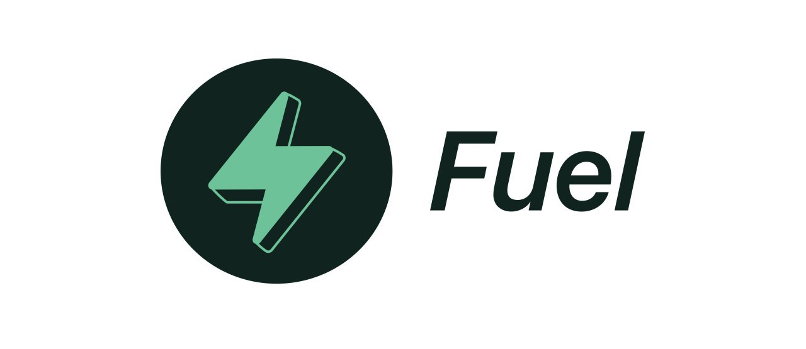

Fuel
===

Fuel is a high-performance optimistic rollup optimized for ERC-20 transfers and swaps, designed for interoperable performance, scalability, and efficiency.


[](https://opensource.org/licenses/Apache-2.0)
[](https://discord.gg/xfpK4Pe)

Features
---

- Completely decentralized: non-custodial, censorship resistant, and permissionless
- The most scalable optimistic rollup in the world, with unique UTXO-based design
- Up to 10,000 TPS surge intake capacity
- Send and receive using any Ethereum address, no registration required
- ETH and all ERC-20 tokens are supported
- Non-custodial token swaps between any tokens
- Fees can be paid in any token, not just ETH
- HTLCs for cross-chain atomic swaps and additional usecases
- Withdrawals in under 10 minutes using atomic swaps
- Interoperable, any contract or address can use, verify, and control assets on Fuel

See the detailed [specification](https://docs.fuel.sh) for a more intimate overview of the design decisions behind Fuel.

Building From Source
---

### Install Dependencies

Install [Node.js](https://nodejs.org/en/) `>= v10.16.0`.

Then run:

```sh
npm install
```

### Build

```sh
npm run build
```

### Run Tests

Run all tests using:

```sh
npm test
```

### Run Benchmarks

Run all benchmarks using:

```sh
npm run benchmark
```

### Run Verify

Verify the Mainnet deployment of Fuel using:

```sh
npm run verify
```

Specify an [Infura](https://infura.io/) developer key as `fuel_v1_default_infura` in your environment variables.